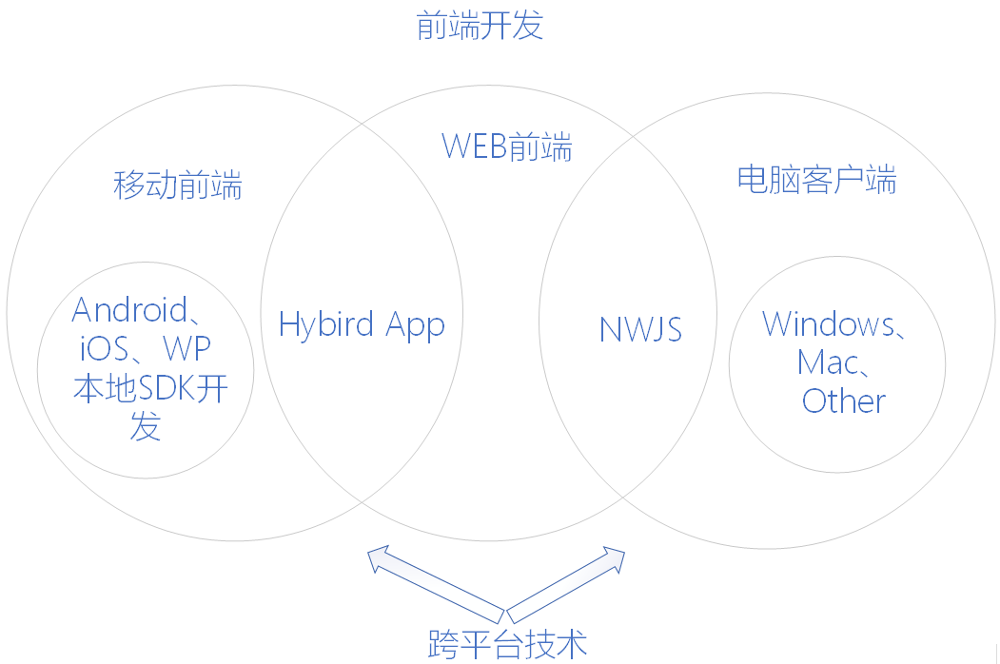
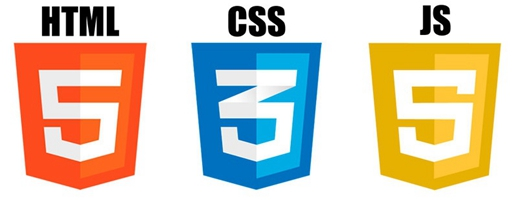

# 前端开发

## 前端划分

## WEB前端开发

WEB前端开发是从网页制作演变而来，名称上有很明显的时代特征。在互联网的演化进程中，网页制作是Web1.0时代的产物，早期网站主要内容都是静态，以图片和文字为主，用户使用网站的行为也以浏览为主。随着互联网技术的发展和HTML5、CSS3的应用，现代网页更加美观，交互效果显著，功能更加强大。

### [HTML基础课程](node1/README.md)

### [CSS基础课程](node2/README.md)

### [JavaScript入门与实战](node3/README.md)

### [JavaScript高级实战](node4/README.md)

### [jQuery入门与实战](node5/README.md)

### [常用库和前端框架](node6/README.md)

### [HTML5新功能和高级机制](node7/README.md)

### [CSS3新特性详解](node8/README.md)

### [实战案例](node9/README.md)

