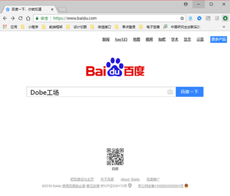
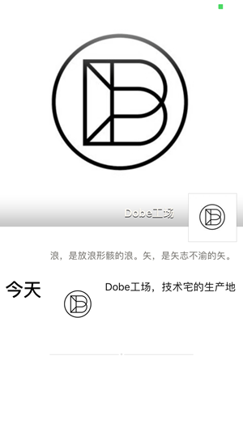
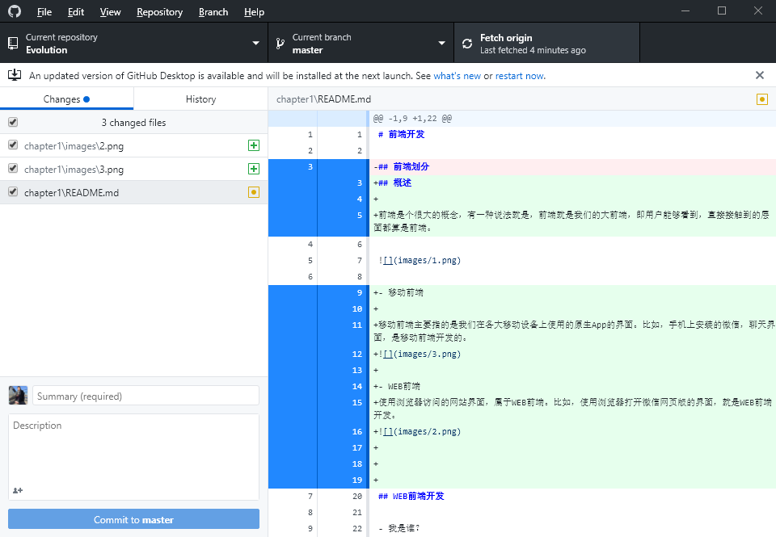
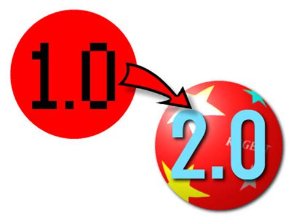

# 前端开发

## 简介

前端是个很大的概念，有一种说法就是，前端就是我们的大前端，即用户能够看到，直接接触到的层面都算是前端。

### 前端划分

- WEB前端

使用浏览器 (手机、电脑) 访问的网站界面，属于WEB前端。比如，使用浏览器打开百度，所展示的页面就是WEB前端开发。

 

- 移动前端

移动前端主要指的是我们在各大移动设备上使用的原生App的界面。比如，手机微信的聊天界面和朋友圈界面等，都是移动前端开发的。

- 电脑客户端

电脑上安装的一些桌面软件界面，属于客户端的前端界面。比如，我们以后开发经常使用的Github客户端软件。

### 跨平台

移动领域的开发，目前面临不同操作系统需不同开发语言，同一操作系统存在不同版本，同一版本存在不同机型等难题，给移动开发增加了很大难度。在移动开发领域，跨平台开发技术成为很多企业和开发者的首选，可以有效解决不同操作系统不同机型终端的开发难题，为企业节省时间成本和人员成本。

随着HTML5的崛起、JavaScript一统天下之际，跨平台技术越来越火，这也使得前端工程师越来越受到重视。

- 混合模式移动应用 (Hybrid App)

Hybrid App是指介于web-app、native-app这两者之间的app，兼具“Native App良好用户交互体验的优势”和“Web App跨平台开发的优势”。

 

- NW.js*

nw.js又叫node-webkit，是基于node.js和chromium的桌面应用程序开发方案。

## WEB前端开发

WEB前端开发学习的内容较容易，且需求更广，适用性更强，无需配置复杂的环境，简单的文本编辑器即可开发，所见即所得的开发模式很适合我们入门学习。

- 我是谁？

Web前端开发是一项很特殊的工作，涵盖的知识面非常广，既有具体的技术，又有抽象的理念。简单地说，它的主要职能就是把网站的界面更好地呈现给用户。Web前端开发需要专业的前端工程师才能做好，这方面的专业人才近几年来备受青睐。

- 我从哪里来？

  - Web1.0时代：网站主要内容都是静态，以图片和文字为主，用户使用网站的行为也以浏览为主，开发人员使用Photoshop和Dreamweaver等工具进行网页制作。

  - Web2.0时代：随着互联网技术的发展和HTML5、CSS3的应用，各种Web应用大量涌现，网站的前端由此发生了翻天覆地的变化。各类网站更加注重于用户体验和交互，所以Web2.0时期不再叫网页制作，而是叫Web前端开发。

## 推荐网站

- [w3school 在线教程](http://www.w3school.com.cn/)

内容不全，部分内容过时

`www.w3school.com.cn` 

- [菜鸟教程](http://www.runoob.com/)

适合新手入门学习和参考

`www.runoob.com` 

- [DevDocs API Documentation](http://devdocs.io/)

手册涵盖全面，内容实时更新

`devdocs.io` 