# 前端简介

## 1. 概述

前端是个很大的概念，有一种说法就是，前端就是我们的大前端，即用户能够看到，直接接触到的层面都算是前端。

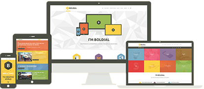

### 1.1 前端划分

- WEB 前端

使用浏览器 (手机、电脑) 访问的网站界面，属于 WEB 前端。比如，使用浏览器打开百度，所展示的页面就是WEB前端开发。本章节所介绍的前端开发也指的是我们的 WEB 前端开发。

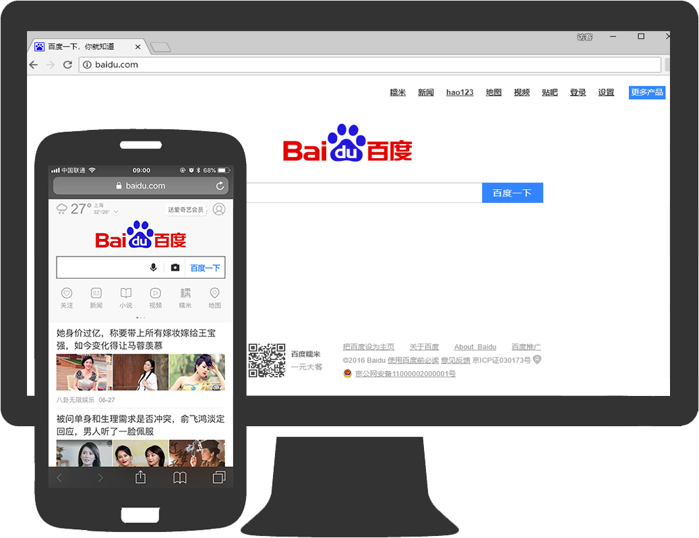 

- 移动前端

移动前端主要指的是我们在各大移动设备上使用的原生App的界面。比如，手机微信的聊天界面和朋友圈界面等，都是移动前端开发的。

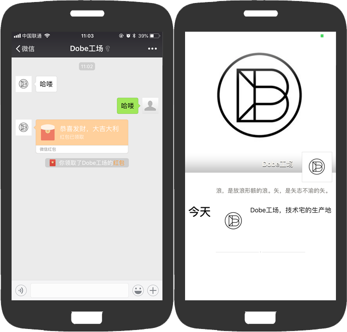

- 电脑客户端

电脑上安装的一些桌面软件界面，属于客户端的前端界面。比如，我们以后开发经常使用的 Github 客户端软件。

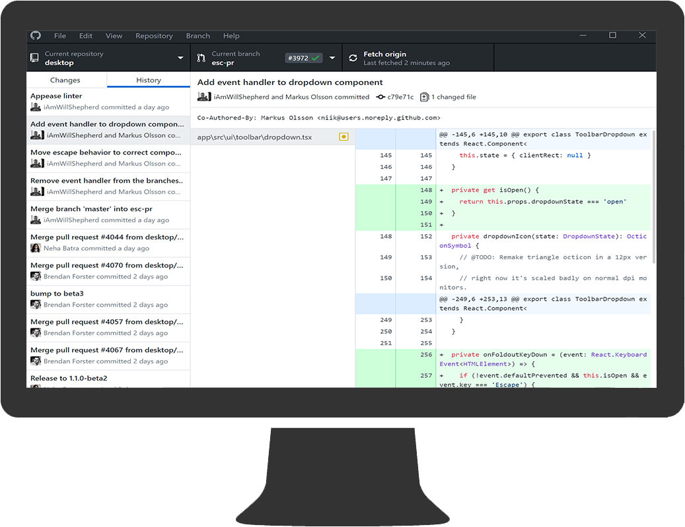

### 1.2 跨平台

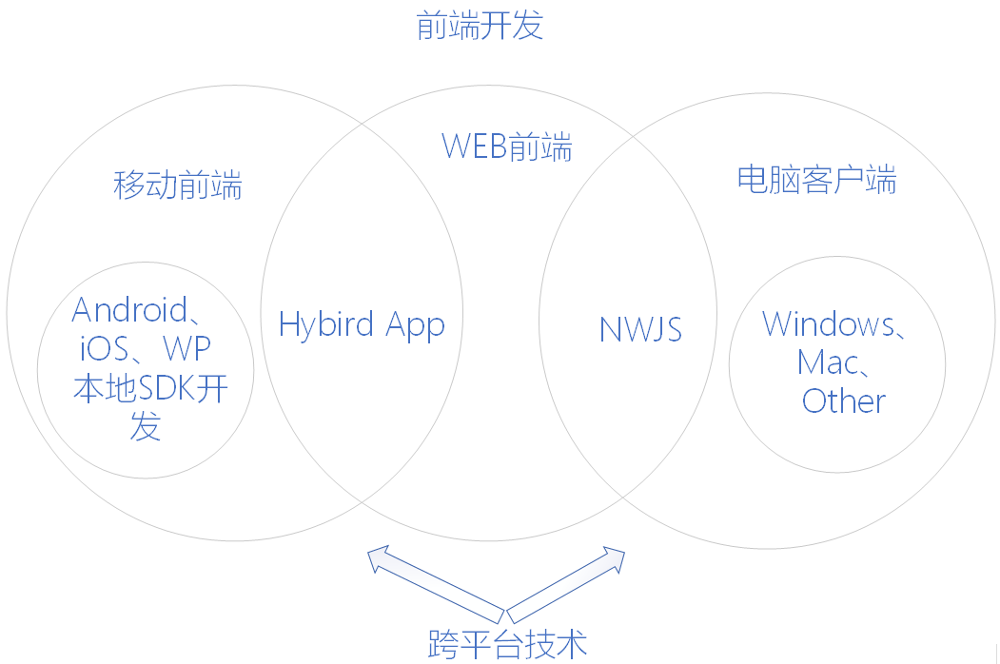

移动领域的开发，目前面临不同操作系统需不同开发语言，同一操作系统存在不同版本，同一版本存在不同机型等难题，给移动开发增加了很大难度。在移动开发领域，跨平台开发技术成为很多企业和开发者的首选，可以有效解决不同操作系统不同机型终端的开发难题，为企业节省时间成本和人员成本。

随着 HTML5 的崛起、 JavaScript 一统天下之际，跨平台技术越来越火，这也使得前端工程师越来越受到重视。

- Hybrid App

Hybrid App 为混合模式移动应用，是指介于 web-app、native-app 这两者之间的app，兼具“Native App良好用户交互体验的优势”和“Web App跨平台开发的优势”。

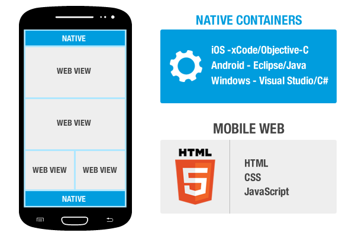

- NW.js*

nw.js 又叫 node-webkit ，是基于 node.js 和 chromium 的桌面应用程序开发方案。

## 2. WEB 前端开发

Web 前端开发学习的内容较容易，且需求更广，适用性更强，无需配置复杂的环境，简单的文本编辑器即可开发，所见即所得的开发模式很适合我们入门学习。

知其然，知其所以然！学习 WEB 前端开发前，我们先探讨三个哲学问题！

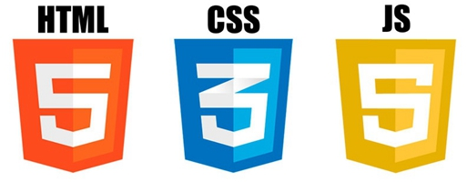

### 2.1 我是谁？

Web 前端开发是一项很特殊的工作，涵盖的知识面非常广，既有具体的技术，又有抽象的理念。简单地说，它的主要职能就是把网站的界面更好地呈现给用户。Web前端开发需要专业的前端工程师才能做好，这方面的专业人才近几年来备受青睐。

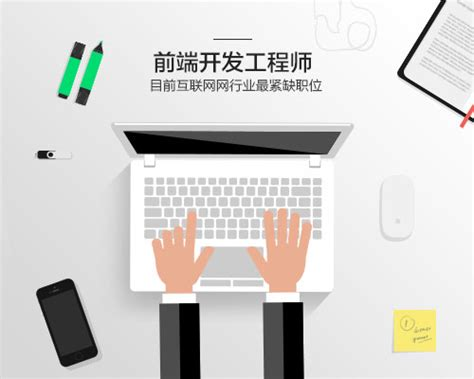

### 2.2 我从哪里来？

- Web 1.0时代———互联网中世纪

提到 Web 1.0，感觉要回溯至「互联网的中世纪」。众所周知，Internet 只是一组静态网站，其中包含大量信息却没有互动内容。

网站开发人员使用 Photoshop 和 Dreamweaver 等工具进行网页制作。

**Web 1.0 时代，互联网是一家大型实体商场，房子固定在那里(人们只能通过电脑在固定的地方接入互联网)，用户只能购买商场展示的商品。**

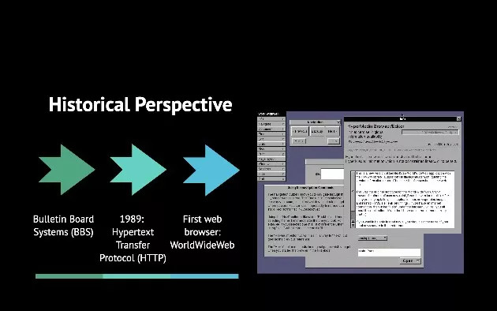

- Web 2.0 时代————真正的网民参与

到了 2.0 时代，用调制解调器拨号上网的短暂时光迅速消失。互联网变得更快了，更快的网速为互动内容铺平了道路，网络世界里能做的事情不再仅仅是围观，而是参与。

随着互联网技术的发展和 HTML5、CSS3 的应用，各种 Web 应用大量涌现，网站的前端由此发生了翻天覆地的变化。各类网站更加注重于用户体验和交互。所以 Web 2.0 时期不再叫网页制作，而是叫 Web 前端开发。

**Web 2.0 时代，大型商场变成可移动的了 (移动设备的出现人们随时随地都可以接入互联网)，而且商场卖的东西更加多样化，顾客的衣食住行方面的所需都可以在商场买到。同时，商场给用户提供一个平台，每个用户都可以在商场里面开小店铺，把自己生产的小商品放到店铺展示。用户在逛商场时候，可以挑选各种各样的商品，如果没有自己需要的商品，还可以在商场发布消息，请其他用户帮忙生产出来。**

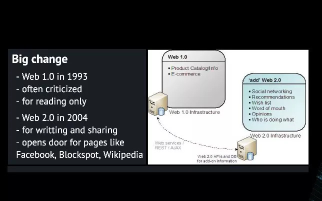

<!-- 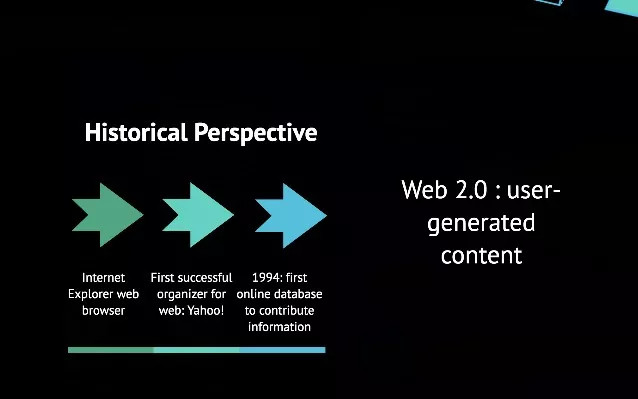 -->

- Web 3.0时代————回归初衷，以人为本

在 3.0 阶段，一拨新的互联网冒险家梦想成为时代的继任者。他们设想的下一个网络将回归至 Web 1.0 的愿景：更「人性化」，也更隐私。而不是将权力和数据集中在巨大的公司庞然大物手中，而这些巨兽往往被视作你的隐私合法所有者。

更公平、透明的网络愿景可以追溯到 2006 年左右，但在那时，工具和技术无法实现这一愿景。比特币诞生以来，为分布式账本、区块链带来了点对点的数字存储概念。这个设想提倡去中心化，而区块链是实现的新兴技术手段。从此开始，我们似乎可以真正去描述一个以人为本的互联网形态。

**Web 3.0 时代，商场更加智能化人性化，你想去商场吃饭，商场会分析你的口味、饮食习惯、健康状况等个人信息，并给你提供最适合的一家餐厅，而且给你推荐餐厅最适合你的菜品。**

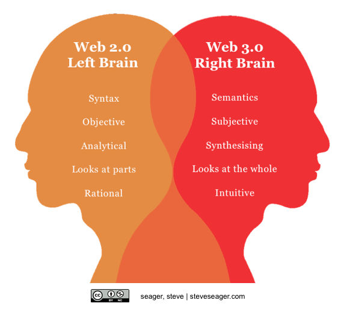

### 2.3 我要到哪里去？

随着 Web 3.0 开始行动起来，新的平台将出现，不会受到垄断服务提供商的限制，导致不公平的竞争。

当然，没有谁会被彻底抛弃，正如 Web 2.0 不会消失，仍然在互联网某些地方吃灰的 Web 1.0 一样，迁移到 Web 3.0 与现有的在线网络系统集成，仍需要不短的时间。

>**Web 3.0 未来已来。列车已经启动，且不会掉头。**

## 3. 推荐网站

- **[w3school 在线教程](http://www.w3school.com.cn/)**

内容不全，部分内容过时

`www.w3school.com.cn` 

- **[菜鸟教程](http://www.runoob.com/)**

适合新手入门学习和参考

`www.runoob.com` 

- **[DevDocs API Documentation](http://devdocs.io/)**

手册涵盖全面，内容实时更新

`devdocs.io` 