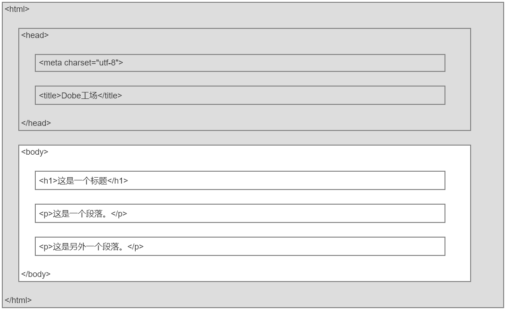
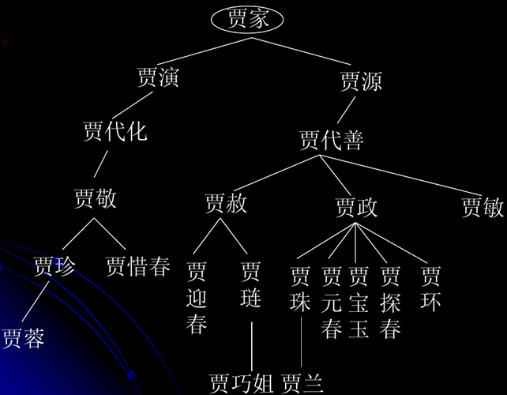

# HTML基础课程

## 1. 实例

### 1.1 源码

```
<!DOCTYPE html>
<html>
<head>
<meta charset="utf-8">
<title>Dobe工场</title>
</head>
<body>
<h1>我的第一个标题</h1>
<p>我的第一个段落。</p>
<p>这是另外一个段落。</p>
</body>
</html>
```

### 1.2 解析

- `<!DOCTYPE html>` 声明为 HTML5 文档
- `<html>` 标签是 HTML 页面的根元素
- `<head>` 元素包含了文档的元（meta）数据
- `<meta>` 元素指定网页的描述，关键词，文件的最后修改时间，作者及其他元数据。
- `<title>` 元素描述了文档的标题
- `<body>` 元素包含了可见的页面内容
- `<h1>` 元素定义一个大标题
- `<p>` 元素定义一个段落

下面是一个可视化的HTML页面结构：



*<strong>Tpis:</strong>只有 ` <body> `区域 (白色部分) 才会在浏览器中显示。*

## 2. 什么是HTML？

HTML是用来描述网页的一种语言。

- HTML指的是超文本标记语言: HyperText Markup Language
- HTML不是一种编程语言，而是一种标记语言
- 标记语言是一套标记标签 (markup tag)
- HTML使用标记标签来描述网页
- HTML文档包含了 HTML 标签及文本内容
- HTML文档也叫做 web 页面

## 3. HTML组成

### 3.1 HTML标签 (tag)

- HTML标签是由尖括号包围的关键词，比如 `<html>`
- HTML标签通常是成对出现的，比如 `<b>` 和 `</b>`
- 标签对中的第一个标签是开始标签，第二个标签是结束标签
- 开始和结束标签也被称为开放标签和闭合标签

### 3.2 HTML元素 (element)

- HTML元素以开始标签起始
- HTML元素以结束标签终止
- 元素的内容是开始标签与结束标签之间的内容
- 某些HTML元素具有空内容（empty content）
- 空元素在开始标签中进行关闭（以开始标签的结束而结束）
- 大多数HTML元素可拥有属性

### 3.3 总结

很多人对元素和标签不理解，会混为一谈，其实只要看懂下面的公式：

**狗头 + 狗身体 + 狗尾巴 = 狗尾巴**

**开始标签 + 内容 + 结束标签 = 元素**


` <p> `这就是一个标签

` <p>这里是内容</p> ` 这就是一个元素

也就是说元素由一个开始的标签和结束的标签组成，用来包含某些内容。

*<strong>Tpis:</strong>没有内容的 HTML 元素被称为空元素。空元素是在开始标签中关闭的。` <br> ` 就是没有关闭标签的空元素 (` <br> ` 标签定义换行) 。在 XHTML、XML 以及未来版本的 HTML 中，所有元素都必须被关闭。在开始标签中添加斜杠，比如 ` <br /> `，是关闭空元素的正确方法，HTML、XHTML 和 XML 都接受这种方式。即使 ` <br> ` 在所有浏览器中都是有效的，但使用 ` <br/> ` 其实是更长远的保障。*

## 4. HTML网页运行原理

一个HTML文件，记事本打开是代码。浏览器打开，则是可视化页面。Why？

从我们在地址栏输入bing.com到看到Bing主页过程中都发生了什么？

### 4.1 文档对象模型 (Document Object Model)

文档对象模型 (Document Object Model，简称DOM)，是W3C组织推荐的处理可扩展标志语言的标准编程接口。在网页上，组织页面 (或文档) 的对象被组织在一个树形结构中，用来表示文档中对象的标准模型就称为DOM。

下面是一个DOM树模型图：


下面是红楼梦家谱图：


### 4.2 渲染引擎 (The Rendering Engine)

Web浏览器 (如谷歌浏览器，Internet Explorer，Firefox，Safari) 读取HTML文件后，并不是直接显示的HTML标签，通过解析标签展示不同的页面效果，这些操作都归功于浏览器的渲染引擎。

渲染引擎是一种对HTML文档进行解析并将其显示在页面上的工具。它负责取得网页的内容 (HTML、XML、图象等等)、整理信息 (例如加入CSS等)，以及计算网页的显示方式然后会输出至显示器或打印机。

### 4.3 渲染引擎工作原理

- 构建DOM树

渲染引擎开始解析HTML文档，并将文档的标签转化为内容树中的DOM节点

- 构建Render树

渲染引擎解析外部CSS文件及style标签中的样式信息，这些样式信息以及HTML中的可见性指令将被用来构建另一棵树——Render树。Render树由一些包含有颜色和大小等属性的矩形组成，它们将被按照正确的顺序显示到屏幕上。

- 布局Render树

Render树构建好了之后，将会执行布局过程，它将确定每个节点在屏幕上的确切坐标。

- 绘制DOM树

渲染引擎会遍历所有的DOM节点，并使用UI后端层绘制。

*<strong>Tpis:</strong>渲染过程是逐步完成的，为了更好的用户体验，渲染引擎将会尽可能早的将内容呈现到屏幕上，并不会等到所有的HTML都解析完成之后再去构建和布局Render树。而是解析完一部分内容就显示一部分内容，同时，可能还在通过网络下载其余内容。*

### 4.4 主流浏览器的渲染引擎工作流程

- Webkit工作流程

Safari和Chrome都使用Webkit，Webkit是一款开源渲染引擎，它本来是为Linux平台研发的，后来由Apple移植到Mac及Windows上。


- Gecko工作流程

Firefox使用Geoko——Mozilla自主研发的渲染引擎。


- 总结

Webkit和Gecko属于不同，但流程基本相同。 Gecko将视觉化后的树称为“框架树”，Webkit称为“渲染树”；对于元素的排放，Webkit称为“布局layout”，gecko称为“重拍reflow”；Gecko在html解析和DOM树间添加了“内容槽”，用于生成DOM元素；将DOM树和样式信息构建渲染树的过程，Webkit称为“附加”，Gecko称为“框架结构”。

## 2. HTML标签

HTML 标签是由尖括号包围的关键词

<style>
table th{
	background-color: lightgrey;
}
table th:first-of-type {
    width: 200px;
}
table tr td span.new{
    float: right;
    color: #fff;
    background-color: #90b575;
    padding-left: 1px;
    padding-right: 1px;
    border: 1px solid #fff;
    outline: 1px solid #90b575;
    line-height: 12px;
}
</style>

### 2.1 基础标签
标签 | 描述 
:- |:- 
`<!DOCTYPE>` | 声明文档类型
`<html>` | 定义一个 HTML 文档
`<title>` | 为文档定义一个标题
`<body>` | 定义文档的主体
`<h1> to <h6>` | 定义 HTML 标题
`<p>` | 定义一个段落
`<br>` | 定义简单的折行
`<hr>` | 定义水平线
`<!--...-->` | 定义一个注释

### 2.2 元信息标签
标签 | 描述 
:- |:- 
`<head>` | 定义关于文档的信息
`<meta>` | 定义关于 HTML 文档的元信息
`<base>` | 定义页面中所有链接的默认地址或默认目标

### 2.3 样式/节标签
标签 | 描述 
:- |:- 
`<style>` | 定义文档的样式信息
`<div>` | 定义文档中的块
`<span>` | 定义文档中的段落
`<header>` | 定义一个文档头部部分
`<footer>` | 定义一个文档底部
`<section>` | 定义了文档的某个区域
`<article>`* | 定义一个文章内容
`<aside>`* | 定义其所处内容之外的内容

### 2.4 格式标签
标签 | 描述 
:- |:- 
`<b>` | 定义粗体文本
`<i>` | 定义斜体文本
`<u>` | 定义下划线文本
`<del>` | 定义被删除文本
`<s>` | 标记不再正确的文本
`<small>` | 定义小号文本
`<strong>` | 定义语气更为强烈的强调文本
`<mark>`<span class="new">New</span> | 定义带有记号的文本
`<pre>`* | 定义预格式文本
`<abbr>`* | 定义一个缩写

### 2.5 图像标签
标签 | 描述 
:- |:- 
`` | 定义图像
`<map>` | 定义图像映射
`<area>` | 定义图像地图内部的区域
`<canvas>`<span class="new">New</span> | 通过脚本（通常是 JavaScript）来绘制图形（比如图表和其他图像）
`<figure>`* | 用于对元素进行组合
`<figcaption>`* | 为figure提供图片说明

### 2.6 列表标签
标签 | 描述 
:- |:- 
`<li>` | 定义一个列表项
`<ul>` | 定义一个无序列表
`<ol>` | 定义一个有序列表

### 2.7 表格标签
标签 | 描述 
:- |:- 
`<table>` | 定义一个表格
`<th>` | 定义表格中的表头单元格
`<tr>` | 定义表格中的行
`<td>` | 定义表格中的单元
`<caption>`* | 定义表格标题
`<thead>`* | 定义表格中的表头内容
`<tbody>`* | 定义表格中的主体内容
`<tfoot>`* | 定义表格中的表注内容（脚注）
`<col>`* | 定义表格中一个或多个列的属性值
`<colgroup>`* | 定义表格中供格式化的列组

### 2.8 链接标签
标签 | 描述 
:- |:- 
`<a>` | 定义一个链接
`<link>` | 定义文档与外部资源的关系
`<nav>`<span class="new">New</span> | 定义导航链接

### 2.9 表单标签
标签 | 描述 
:- |:- 
`<form>` | 定义一个 HTML 表单，用于用户输入
`<input>` | 定义一个输入控件
`<textarea>` | 定义多行的文本输入控件
`<button>` | 定义按钮
`<select>` | 定义选择列表（下拉列表）
`<option>` | 定义选择列表中的选项
`<label>` | 定义 input 元素的标注
`<fieldset>`* | 定义围绕表单中元素的边框
`<legend>`* | 定义 fieldset 元素的标题
`<datalist>`*<span class="new">New</span> | 规定了 input 元素可能的选项列表【Safari不支持】
`<keygen>`*<span class="new">New</span> | 规定用于表单的密钥对生成器字段【IE不支持】
`<output>`*<span class="new">New</span> | 定义一个计算的结果【IE不支持】

### 2.10 媒体标签
标签 | 描述 
:- |:- 
`<audio>`<span class="new">New</span> | 定义声音，比如音乐或其他音频流
`<video>`<span class="new">New</span> | 定义一个音频或者视频
`<source>`<span class="new">New</span> | 定义媒体元素 (`<video>` 和 `<audio>`)的媒体资源

### 2.11 框架标签
标签 | 描述 
:- |:- 
`<iframe>`* | 定义内联框架

### 2.12 程序标签
标签 | 描述 
:- |:- 
`<script>` | 定义客户端脚本
`<noscript>`* | 定义针对不支持客户端脚本的用户的替代内容
`<embed>`*<span class="new">New</span> | 定义了一个容器，用来嵌入外部应用或者互动程序（插件）
`<object>`* | 定义嵌入的对象
`<param>`* | 定义对象的参数

## 3. 元素属性

### 3.1 概述

HTML 元素可以拥有属性。属性提供了有关 HTML 元素的更多的信息。

属性总是以名称/值对的形式出现，比如：name="value"。

属性总是在 HTML 元素的开始标签中规定。

### 3.2 全局属性
属性 | 描述 
:- |:- 
id | 规定元素的唯一
class | 规定元素的类名（classname）
style | 规定元素的行内样式（inline style）
data-*<span class="new">New</span> | 用于存储页面的自定义数据
hidden<span class="new">New</span> | 属性规定对元素进行隐藏
draggable<span class="new">New</span> | 指定某个元素是否可以拖动
contenteditable<span class="new">New</span> | 规定是否可编辑元素的内容
tabindex | 设置元素的 Tab 键控制次序
accesskey | 设置访问元素的键盘快捷键
title | 规定元素的额外信息（可在工具提示中显示）
spellcheck<span class="new">New</span> | 检测元素是否拼写错误
dir | 设置元素中内容的文本方向
lang | 设置元素中内容的语言代码