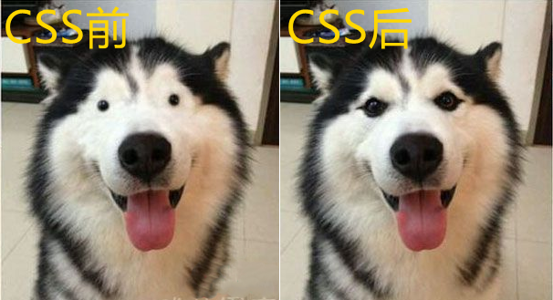
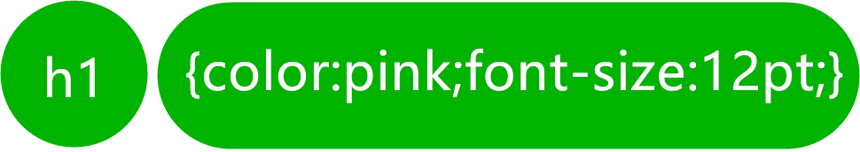
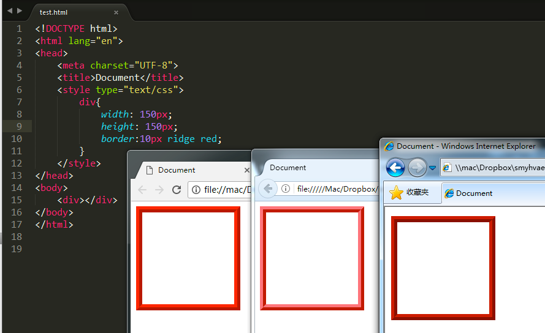
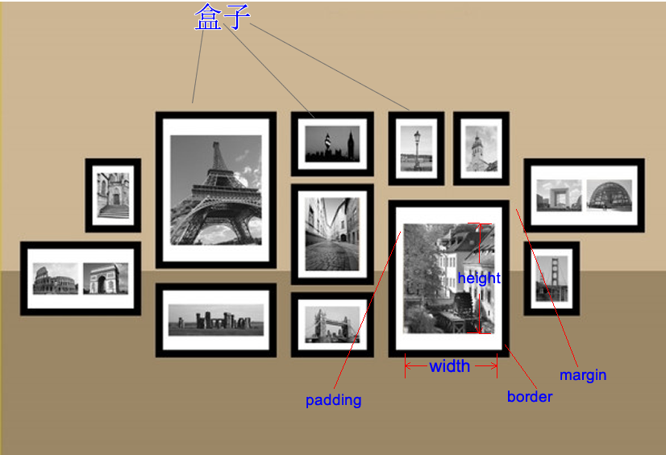
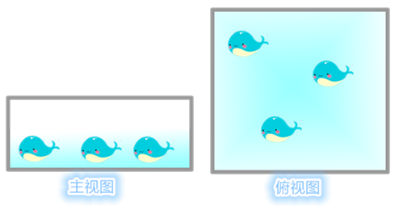
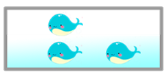
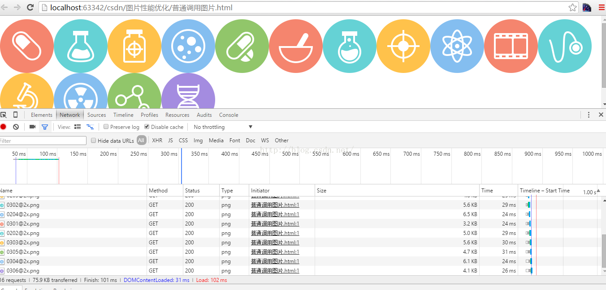
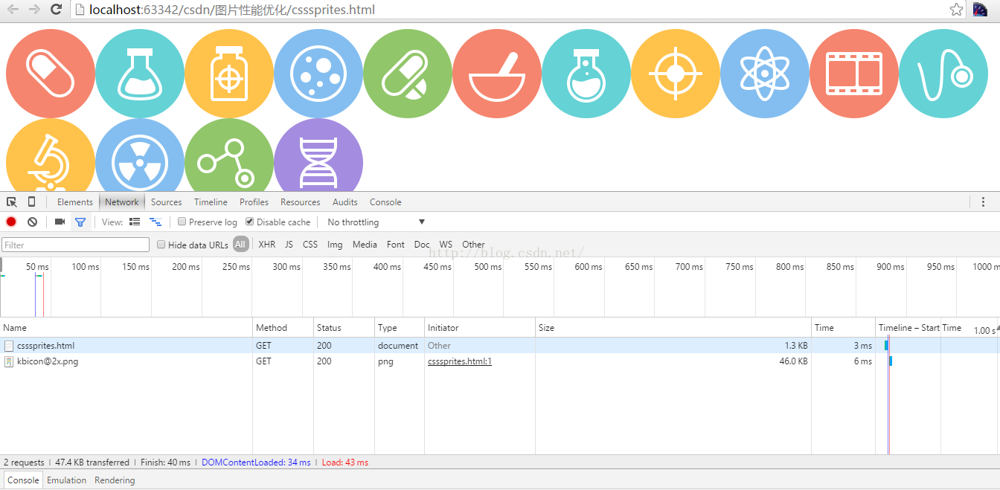

# CSS基础课程

## 1. 实例

### 1.1 源码
```css
/*这是 mystyle.css 文件*/
h1 {color:pink;font-size: larger;}
```
```html
<!-- 这是 HTML 文件 -->
<!DOCTYPE html>
<html>
    <head>
        <meta charset="utf-8">
        <title>Dobe工场</title>
        <link rel="stylesheet" type="text/css" href="mystyle.css">
        <style type="text/css">
            h1 {color:red;}
            p {color:blue;}
            #one {background-color: yellow;}
        </style>
    </head>
    <body>
        <h1>我的第一个标题</h1>
        <p id="one">我的第一个段落。</p>
        <p style="background-color:greenyellow;">这是另外一个段落。</p>
    </body>
</html>
```

### 1.2 解析

- `<rel="stylesheet" type="text/css" href="mystyle.css">`

引入外部的样式表文件 mystyle.css，mystyle.css文件中定义了h1元素字体颜色为 pick，字体大小为大号

- `h1 {color:red;}`

h1元素中的字体颜色为 red

- `p {color:blue;}`

p元素中的字体颜色为 blue

- `#one {background-color: yellow;}`

id为 one 的元素背景色为 yellow

- `<p style="background-color:greenyellow;"></p>这是另外一个段落。</p>`

该p元素有 style 样式属性，样式定义其背景色为 greenyellow

## 2. 什么是 CSS？

上一章节讲到 HTML 元素 (`<p>xxx</p>`) 是狗，那么 CSS 就是给狗美颜的，让这只狗拥有好看的皮囊。



### 2.1 定义
CSS 指层叠样式表 (Cascading Style Sheets)，是一种用来表现 HTML 或 XML 等文件样式的计算机语言。

- 样式定义如何显示 HTML 元素
- 样式通常存储在样式表中
- 是为了解决内容与表现分离的问题
- 多个样式定义可层叠为一

### 2.2 样式表与层叠

#### 样式表

- **外部样式表 (External style sheet)**

当样式需要应用于很多页面时，外部样式表将是理想的选择。在使用外部样式表的情况下，你可以通过改变一个文件来改变整个站点的外观。每个页面使用 `<link>` 标签链接到样式表。 `<link>` 标签在（文档的）头部：
```html
<head>
    <link rel="stylesheet" type="text/css" href="mystyle.css">
</head>
```
浏览器会从文件 mystyle.css 中读到样式声明，并根据它来格式文档。

- **内部样式表 (Internal style sheet)**

当单个文档需要特殊的样式时，就应该使用内部样式表。你可以使用 `<style type="text/css">` 标签在文档头部定义内部样式表，就像这样:
```html
<head>
    <style type="text/css">
        h1 {color:red;}
        p {color:blue;}
        #one {background-color: yellow;}
    </style>
</head>
```

- **内联样式 (Inline style)**

由于要将表现和内容混杂在一起，内联样式会损失掉样式表的许多优势。请慎用这种方法，例如当样式仅需要在一个元素上应用一次时。

要使用内联样式，你需要在相关的标签内使用样式（style）属性。Style 属性可以包含任何 CSS 属性。本例展示如何改变段落的颜色和左外边距：
```html
<p style="background-color:greenyellow;">这是另外一个段落。</p>
```

#### 层叠

- **多重样式**

如果某些属性在不同的样式表中被同样的选择器定义，那么属性值将从更具体的样式表中被继承过来。 

例如，外部样式表拥有针对 h1 选择器的属性：
```css
h1 {
    color:pink;
    font-size: larger;
    }
```
而内部样式表拥有针对 h1 选择器的属性：
```css
h1 {
    color:red;
    }
```
假如拥有内部样式表的这个页面同时与外部样式表链接，那么 h1 得到的样式是：
```css
h1 {
    color:red;
    font-size: larger;
    }
```

- **多重样式优先级**

式表允许以多种方式规定样式信息。样式可以规定在单个的 HTML 元素中，在 HTML 页的头元素中，或在一个外部的 CSS 文件中。甚至可以在同一个 HTML 文档内部引用多个外部样式表。

一般情况下，优先级公式如下：

<span class='label label-pill label-info'>
内联样式 > 内部样式 > 外部样式 > 浏览器默认样式
</span>

## 2. CSS基础及语法

CSS 规则由两个主要的部分构成：选择器，以及一条或多条声明。



选择器通常是您需要改变样式的 HTML 元素。

每条声明由一个属性和一个值组成。

属性 (property) 是您希望设置的样式属性 (style attribute) 。每个属性有一个值。属性和值被冒号分开。属性与属性之间用分号隔开。

具体语法公式如下：

<span class='label label-pill label-info'>
选择器 { 属性1: 值1; 属性2: 值2; }
</span>

## 3. CSS选择器

### 3.1 概述

现在 HTML 文档中有三个 p 元素，分别表示三只狗。id 属性是相当于每只狗的编号，是唯一属性。class 属性表示狗的类名，显然，他们都属于 dog 这个类。
```html
<p id="dog001" class="dog">编号为001的狗</p>
<p id="dog002" class="dog">编号为002的狗</p>
<p id="dog003" class="dog">编号为003的狗</p>
```
现在需要完成两件事：

1. 把所有的“狗”字体颜色改为白色 (white)
2. 编号为002的“狗”字体大小改为 16pt

我们的 CSS 样式可以这样美颜：
```css
.dog { color: white; }
#dog002 { font-size: 16pt; }
```
`.dog`是一个 class 选择器，它表示选择所有 class 属性为 dog 的元素。

`#dog002`是一个 id 选择器，它表示选择 id 属性为 dog002 的元素，选择的元素是唯一的。

### 3.2 常用选择器

除了上面讲到的 id 选择器和 class 选择器以外，CSS 还提供了各种不同的选择方案，用于选择你想要的元素。

下面是 CSS 提供一些常用的基本选择器。

*如需了解更多选择器，请访问：http://www.runoob.com/cssref/css-selectors.html*

<table class="table-css-select">
    <tr>
        <th width="22%">选择器</th>
        <th width="17%">示例</th>
        <th width="56%">示例说明</th>
        <th>CSS</th>
    </tr>
    <tr>
        <td>#<i>id</i></td>
        <td>#firstname</td>
        <td>选择所有id="firstname"的元素</td>
        <td>1</td>
    </tr>
    <tr>
        <td>.<i>class</i></td>
        <td>.intro</td>
        <td>选择所有class="intro"的元素</td>
        <td>1</td>
    </tr>
    <tr>
        <td>*</td>
        <td class="code notranslate">*</td>
        <td>选择所有元素</td>
        <td>2</td>
    </tr>
    <tr>
        <td><i>element</i></td>
        <td>p</td>
        <td>选择所有&lt;p&gt;元素</td>
        <td>1</td>
    </tr>
    <tr>
        <td><i>element,element</i></td>
        <td>div,p</td>
        <td>选择所有&lt;div&gt;元素和&lt;p&gt;元素</td>
        <td>1</td>
    </tr>
    <tr>
        <td><i>element</i> <i>element</i></td>
        <td>div p</td>
        <td>选择&lt;div&gt;元素内的所有&lt;p&gt;元素</td>
        <td>1</td>
    </tr>
    <tr>
        <td>:hover</td>
        <td>a:hover</td>
        <td>鼠标停留在元素上面时</td>
        <td>1</td>
    </tr>
    <tr>
        <td>:focus</td>
        <td>input:focus</td>
        <td>具有焦点的输入元素选中时</td>
        <td>2</td>
    </tr>
    <tr>
        <td>:before</td>
        <td>p:before</td>
        <td>在每个&lt;p&gt;元素之前插入内容</td>
        <td>2</td>
    </tr>
    <tr>
        <td>:after</td>
        <td>p:after</td>
        <td>在每个&lt;p&gt;元素之后插入内容</td>
        <td>2</td>
    </tr>
</table>

### 3.3 选择器优先级

现在有这样一个代码：
```html
<style type="text/css">
    #dog{ color:red;}
    .dog{ color:green;}
</style>
<p id="dog" class="dog">这是一只狗</p>
```
上面的 CSS 选择器都是针对同一个“狗” (元素)，但是设置了不同的颜色，那么这只“狗” (元素)是什么颜色的呢？

- **特指度**
要解决以上问题，我们需要引入一个概念——特指度（specificity）。特指度表示一个css选择器表达式的重要程度，可以通过一个公式来计算出一个数值，数越大，越重要。

这个计算叫做“I-C-E”计算公式：
<span class='label label-pill label-info'>
Id * 100 + Class*10 + Element * 1 = 特指度
</span>

即针对一个 CSS 选择器，遇到一个 id 选择器就往特指度数值中加100，遇到一个 class 选择器就往特指度数值中加10，遇到一个element 选择器就往特指度数值中加1。比如：

p = 1

p.large = 11

P#large = 101

div p#large = 102

div p#large ul.list = 113

div p#large ul.list li = 114

<div class='tips'>
<strong>Tips!</strong><br/>
!important优先级最高，高于上面一切<br/>* 选择器最低，低于一切。
</div>

## 4. CSS 属性组

上节讲了如何选择“狗” (元素)，本节将介绍选择好“狗” (元素)后，做了简单的改变字体颜色和大小的“美颜”。本节将介绍除了字体颜色和大小外，还有哪些“美颜”功能。

HTML 页面上不同的内容有不同的“美颜”方式，比如，文字的“美颜”是调整颜色、大小等属性，图片的“美颜”是调整图片长款等属性。下面我们介绍一些常用的“美颜”属性组，以及其包含的属性用法。

### 4.1 颜色属性

- **color**

规定文本的字体颜色

属性值 | 描述
:--| :--
*color_name* | 规定颜色值为颜色名称的颜色（比如 red）
*hex_number* | 规定颜色值为十六进制值的颜色（比如 #ff0000）
*rgb_number* | 规定颜色值为 rgb 代码的颜色（比如 rgb(255,0,0)）
inherit | 规定应该从父元素继承颜色

*源码*
```html
<style type="text/css">
    #color-1 { color:red; }
    #color-2 { color:#00ff00; }
    #color-3 { color:rgb(0,0,255); }
    #color-4 { color:inherit; }
</style>
<div id="color-1">这是 div1</div>
<div id="color-2">这是 div2</div>
<div id="color-3">
    这是 div3
    <div id="color-4">
        这是 div4
    </div>
</div>
```
*效果*
<div class="preview-code">
    <div id="color-1">这是 div1</div>
    <div id="color-2">这是 div2</div>
    <div id="color-3">
        这是 div3
        <div id="color-4">
            这是 div4
        </div>
    </div>
</div>

### 4.2 字体属性

- **font-family**

规定文本的字体系列

属性值 | 描述
:--| :--
family-name,generic-family | 用于某个元素的字体族名称或/及类族名称的一个优先表。默认值：取决于浏览器
inherit	| 规定应该从父元素继承字体系列

*源码*
```html
<style type="text/css">
    #font-family-1 { font-family:"Times New Roman",Georgia,Serif; }
</style>
<div id="font-family-1">这是 div1</div>
```
*效果*
<div class="preview-code">
    <div id="font-family-1">这是 div1</div>
</div>

- **font-size**

规定文本的字体尺寸

属性值 | 描述
:--| :--
xx-small<br />x-small<br />small<br />medium<br />large<br />x-large<br />xx-large | 绝对字体大小。把字体的尺寸设置为不同的尺寸，从 xx-small 到 xx-large，每种尺寸比前一种大20%。通常情况下，small 为 12px。默认值是 medium
smaller<br />larger	| 相对字体大小。把 font-size 设置为比父元素更小或更大的尺寸
px | 把 font-size 设置为一个固定的值（比如，16px）
em/% | 把 font-size 设置为基于父元素的一个百分比值，1em = 100%
inherit	规定应该从父元素继承字体尺寸

*源码*
```html
<style type="text/css">
    #font-size-1 { font-size:xx-small; }
    #font-size-2 { font-size:18px; }
    #font-size-3 { font-size:1.5em; }
    #font-size-4 { font-size:inherit; }
</style>
<div>标准字体</div>
<div id="font-size-1">这是 div1</div>
<div id="font-size-2">这是 div2</div>
<div id="font-size-3">
    这是 div3
    <div id="font-size-4">
        这是 div4
    </div>
</div>
```
*效果*
<div class="preview-code">
    <div>标准字体</div>
    <div id="font-size-1">这是 div1</div>
    <div id="font-size-2">这是 div2</div>
    <div id="font-size-3">
        这是 div3
        <div id="font-size-4">
            这是 div4
        </div>
    </div>
</div>

- **font-weight**

规定字体粗细

属性值 | 描述
:--| :--
normal | 默认值。定义标准的字符。
bold | 定义粗体字符。
bolder | 定义更粗的字符。
lighter | 定义更细的字符。
100~900 | 定义由粗到细的字符。400 等同于 normal，而 700 等同于 bold。
inherit	| 规定应该从父元素继承字体的粗细。

*源码*
```html
<style type="text/css">
    #font-weight-1 { font-weight:lighter; }
    #font-weight-2 { font-weight:bold; }
    #font-weight-3 { font-weight:900; }
    #font-weight-4 { font-weight:inherit; }
</style>
<div>标准字体</div>
<div id="font-weight-1">这是 div1</div>
<div id="font-weight-2">这是 div2</div>
<div id="font-weight-3">
    这是 div3
    <div id="font-weight-4">
        这是 div4
    </div>
</div>
```
*效果*
<div class="preview-code">
    <div>标准字体</div>
    <div id="font-weight-1">这是 div1</div>
    <div id="font-weight-2">这是 div2</div>
    <div id="font-weight-3">
        这是 div3
        <div id="font-weight-4">
            这是 div4
        </div>
    </div>
</div>


### 4.3 背景属性

- **background-color**

background-color属性设置一个元素的背景颜色。

元素的背景是元素的总大小，包括填充和边界（但不包括边距）。

属性值 | 描述
:--| :--
*color* | 指定背景颜色，同 color 属性的值相同
transparent | 指定背景颜色应该是透明的。这是默认
inherit | 指定背景颜色，应该从父元素继承

*源码*
```html
<style type="text/css">
    #background-color-1 { background-color:lighter; }
    #background-color-2 { background-color:transparent; }
    #background-color-3 { background-color:yellow; }
    #background-color-4 { background-color:inherit; }
</style>
<div id="background-color-1">这是 div1</div>
<div id="background-color-2">这是 div2</div>
<div id="background-color-3">
    这是 div3
    <div id="background-color-4">
        这是 div4
    </div>
</div>
```
*效果*
<div class="preview-code">
    <div id="background-color-1">这是 div1</div>
    <div id="background-color-2">这是 div2</div>
    <div id="background-color-3">
        这是 div3
        <div id="background-color-4">
            这是 div4
        </div>
    </div>
</div>

- **background-image**

background-image属性设置一个元素的背景图像。

元素的背景是元素的总大小，包括填充和边界（但不包括边距）。

默认情况下，background-image放置在元素的左上角，并重复垂直和水平方向。

属性值 | 描述
:--| :--
url('URL') | 图像的URL
none | 无图像背景会显示。这是默认
inherit | 指定背景图像应该从父元素继承

*源码*
```html
<style type="text/css">
    #background-image-1 { background-image:url(../images/bgimage.png); }
    #background-image-2 { background-image:none; }
    #background-image-3 { background-image:url(../images/bgimage.png); }
    #background-image-4 { background-image:inherit; }
</style>
<div id="background-image-1">这是 div1</div>
<div id="background-image-2">这是 div2</div>
<div id="background-image-3">
    这是 div3
    <div id="background-image-4">
        这是 div4
    </div>
</div>
```
*效果*
<div class="preview-code">
    <div id="background-image-1">这是 div1</div>
    <div id="background-image-2">这是 div2</div>
    <div id="background-image-3">
        这是 div3
        <div id="background-image-4">
            这是 div4
        </div>
    </div>
</div>

- **background-position**

background-position属性设置背景图像的起始位置。

必须先指定background-image属性。

属性值 | 描述
:--| :--
left top<br />left center<br />left bottom<br />right top<br />right center<br />right bottom<br />center top<br />center center<br />center bottom | 如果仅指定一个关键字，其他值将会是"center"。<br />比如，横向（left,center,right），纵向（top,center,bottom）
x% y% | 第一个值是水平位置，第二个值是垂直。左上角是0％0％。右下角是100％100％。如果仅指定了一个值，其他值将是50％。 。默认值为：0％0％
xpos ypos | 第一个值是水平位置，第二个值是垂直。左上角是0。单位可以是像素（0px0px）或任何其他 CSS单位。如果仅指定了一个值，其他值将是50％。你可以混合使用％和positions
inherit | 指定background-position属性设置应该从父元素继承

- **background-repeat**

设置背景图像如何铺排填充。

必须先指定background-image属性。

属性值 | 描述
:--| :--
repeat | 背景图像将向垂直和水平方向重复。这是默认
repeat-x | 只有水平位置会重复背景图像
repeat-y | 只有垂直位置会重复背景图像
no-repeat | background-image不会重复
inherit | 指定background-repea属性设置应该从父元素继承

### 4.4 文本属性

- **text-align**

text-align属性指定元素文本的水平对齐方式。

属性值 | 描述
:--| :--
left | 把文本排列到左边。默认值：由浏览器决定。
right | 把文本排列到右边。
center | 把文本排列到中间。
justify | 实现两端对齐文本效果。
inherit | 规定应该从父元素继承 text-align 属性的值。

*源码*
```html
<style type="text/css">
    #text-align-1 { text-align:right; }
    #text-align-2 { text-align:center; }
    #text-align-3 { text-align:justify; }
    #text-align-4 { text-align:inherit; }
</style>
<div>默认标准</div>
<div id="text-align-1">这是 div1</div>
<div id="text-align-2">这是 div2</div>
<div id="text-align-3">
    这是 div3
    <div id="text-align-4">
        这是 div4
    </div>
</div>
```
*效果*
<div class="preview-code">
    <div>默认标准</div>
    <div id="text-align-1">这是 div1</div>
    <div id="text-align-2">这是 div2</div>
    <div id="text-align-3">
        这是 div3
        <div id="text-align-4">
            这是 div4
        </div>
    </div>
</div>

- **line-height**

设置以百分比计的行高，即每一行的高度。

负值是不允许的。

属性值 | 描述
:--| :--
normal | 默认。设置合理的行间距。
*number* | 设置数字，此数字会与当前的字体尺寸相乘来设置行间距。
*length* | 设置固定的行间距。比如（line-height:20px;）
% | 基于当前字体尺寸的百分比行间距。
inherit | 规定应该从父元素继承 line-height 属性的值。

*源码*
```html
<style type="text/css">
    #line-height-1 { line-height:2; }
    #line-height-2 { line-height:30px; }
    #line-height-3 { line-height:100%; }
    #line-height-4 { line-height:inherit; }
</style>
<div>默认标准</div>
<div id="line-height-1">DOBE工场</div>
<div id="line-height-2">DOBE工场</div>
<div id="line-height-3">
    DOBE工场
    <div id="line-height-4">
        DOBE工场
    </div>
</div>
```
*效果*
<div class="preview-code">
    <div>默认标准</div>
    <div id="line-height-1">DOBE工场</div>
    <div id="line-height-2">DOBE工场</div>
    <div id="line-height-3">
        DOBE工场
        <div id="line-height-4">
            DOBE工场
        </div>
    </div>
</div>

- **letter-spacing**

letter-spacing 属性增加或减少字符间的空白（字符间距）

属性值 | 描述
:--| :--
normal | 默认。规定字符间没有额外的空间。
*length* | 定义字符间的固定空间（允许使用负值）。
inherit | 规定应该从父元素继承 letter-spacing 属性的值。

*源码*
```html
<style type="text/css">
    #letter-spacing-1 { letter-spacing:5px; }
    #letter-spacing-2 { letter-spacing:-5px; }
    #letter-spacing-3 { letter-spacing:10px; }
    #letter-spacing-4 { letter-spacing:inherit; }
</style>
<div>默认标准</div>
<div id="letter-spacing-1">DOBE工场</div>
<div id="letter-spacing-2">DOBE工场</div>
<div id="letter-spacing-3">
    DOBE工场
    <div id="letter-spacing-4">
        DOBE工场
    </div>
</div>
```
*效果*
<div class="preview-code">
    <div>DOBE工场</div>
    <div id="letter-spacing-1">DOBE工场</div>
    <div id="letter-spacing-2">DOBE工场</div>
    <div id="letter-spacing-3">
        DOBE工场
        <div id="letter-spacing-4">
            DOBE工场
        </div>
    </div>
</div>

- **text-indent**

text-indent 属性规定文本块中首行文本的缩进。

负值是允许的。如果值是负数，将第一行左缩进。

属性值 | 描述
:--| :--
*length* | 定义固定的缩进。默认值：0。
% | 定义基于父元素宽度的百分比的缩进。
inherit | 规定应该从父元素继承 text-indent 属性的值。

*源码*
```html
<style type="text/css">
    #text-indent-1 { text-indent:5px; }
    #text-indent-2 { text-indent:50%; }
    #text-indent-3 { text-indent:10px; }
    #text-indent-4 { text-indent:inherit; }
</style>
<div>默认标准</div>
<div id="text-indent-1">DOBE工场</div>
<div id="text-indent-2">DOBE工场</div>
<div id="text-indent-3">
    DOBE工场
    <div id="text-indent-4">
        DOBE工场
    </div>
</div>
```
*效果*
<div class="preview-code">
    <div>默认标准</div>
    <div id="text-indent-1">DOBE工场</div>
    <div id="text-indent-2">DOBE工场</div>
    <div id="text-indent-3">
        DOBE工场
        <div id="text-indent-4">
            DOBE工场
        </div>
    </div>
</div>

### 4.5 边框属性

- **border-style**

border-style属性设置一个元素的四个边框的样式。

此属性可以有一到四个值。四个值赋值分别是：上-右-下-左 的顺时针方式。

属性值 | 描述
:--| :--
none | 定义无边框。
hidden | 与 "none" 相同。不过应用于表时除外，对于表，hidden 用于解决边框冲突。
dotted | 定义点状边框。在大多数浏览器中呈现为实线。
dashed | 定义虚线。在大多数浏览器中呈现为实线。
solid | 定义实线。
double | 定义双线。双线的宽度等于 border-width 的值。
groove | 定义 3D 凹槽边框。其效果取决于 border-color 的值。
ridge | 定义 3D 垄状边框。其效果取决于 border-color 的值。
inset | 定义 3D inset 边框。其效果取决于 border-color 的值。
outset | 定义 3D outset 边框。其效果取决于 border-color 的值。
inherit | 规定应该从父元素继承边框样式。

border-style的属性值在不同浏览器会有些许差别。比较稳定的属性值是：solid、dashed、dotted。

如果公司里面的设计师是处女座的，追求极高的页面还原度，那么不能使用css来制作边框。就要用到图片，就要切图了。比如border:10px ridge red;这个属性，在chrome和firefox、IE中有细微差别：（因为可以显示出效果，因此并不是兼容性问题，只是有细微差别而已）



*源码*
```html
<style type="text/css">
    #border-style-1 {
        border-style:dotted dashed solid double;
        height: 100px;
        width: 200px;
        }
</style>
<div id="border-style-1">DOBE工场</div>
```
*效果*
<div class="preview-code">
    <div id="border-style-1">DOBE工场</div>
</div>

- **border-width**

border-width属性设置一个元素的四个边框的宽度。

此属性可以有一到四个值。

属性值 | 描述
:--| :--
thin | 定义细的边框。
medium | 默认。定义中等的边框。
thick | 定义粗的边框。
*length* | 允许您自定义边框的宽度。
inherit | 规定应该从父元素继承边框宽度。

*源码*
```html
<style type="text/css">
    #border-width-1 {
        border-style:solid;
        border-width:thin medium thick 10px;
        height: 100px;
        width: 200px;
        }
</style>
<div id="border-width-1">DOBE工场</div>
```
*效果*
<div class="preview-code">
    <div id="border-width-1">DOBE工场</div>
</div>

- **border-color**

border-color属性设置一个元素的四个边框颜色。

此属性可以有一到四个值。

属性值 | 描述
:--| :--
*color* | 指定背景颜色
transparent | 指定边框的颜色应该是透明的。这是默认
inherit | 指定边框的颜色，应该从父元素继承

*源码*
```html
<style type="text/css">
    #border-color-1 {
        border-style:solid;
        border-color:red blue;
        height: 100px;
        width: 200px;
        }
</style>
<div id="border-color-1">DOBE工场</div>
```
*效果*
<div class="preview-code">
    <div id="border-color-1">DOBE工场</div>
</div>

- **border**

缩写边框属性设置在一个声明中所有的边框属性。

可以设置的属性分别（按顺序）：border-width, border-style,和border-color.

如果上述值缺少一个没有关系，例如border：＃FF0000;是允许的。

属性值 | 描述
:--| :--
*border-width* | 指定边框的宽度
*border-style* | 指定边框的样式
*border-color* | 指定边框的颜色
inherit	指定应该从父元素继承border属性值

*源码*
```html
<style type="text/css">
    .border { margin: 10px; }
    #border-1 { border:5px solid red; }
    #border-2 { border:solid red; }
    #border-3 { border:5px red; }
</style>
<div id="border-1">DOBE工场</div>
```
*效果*
<div class="preview-code">
    <div id="border-1" class="border">DOBE工场</div>
    <div id="border-2" class="border">DOBE工场</div>
    <div id="border-3" class="border">DOBE工场</div>
</div>

- **outline**

outline（轮廓）是绘制于元素周围的一条线，位于边框边缘的外围，可起到突出元素的作用。

outline简写属性在一个声明中设置所有的轮廓属性。

可以设置的属性分别是（按顺序）：outline-color, outline-style, outline-width

如果不设置其中的某个值，也不会出问题，比如 outline:solid #ff0000; 也是允许的。

属性值 | 描述
:--| :--
*outline-color* | 规定边框的颜色。
*outline-style* | 规定边框的样式。
*outline-width* | 规定边框的宽度。
inherit	规定应该从父元素继承 outline 属性的设置。

*源码*
```html
<style type="text/css">
    #outline-1 { border:1px solid red; outline:green dotted thick; }
</style>
<div id="border-1">DOBE工场</div>
```
*效果*
<div class="preview-code">
    <div id="outline-1">DOBE工场</div>
</div>

### 4.6 列表属性

- **list-style-type**

list-style-type 属性设置列表项标记的类型。

属性值 | 描述
:--| :--
none | 无标记。
disc | 默认。标记是实心圆。
circle | 标记是空心圆。
square | 标记是实心方块。
decimal | 标记是数字。
decimal-leading-zero | 0开头的数字标记。(01, 02, 03, 等。)
lower-roman | 小写罗马数字(i, ii, iii, iv, v, 等。)
upper-roman | 大写罗马数字(I, II, III, IV, V, 等。)
lower-alpha | 小写英文字母The marker is lower-alpha (a, b, c, d, e, 等。)
upper-alpha | 大写英文字母The marker is upper-alpha (A, B, C, D, E, 等。)
lower-greek | 小写希腊字母(alpha, beta, gamma, 等。)
lower-latin | 小写拉丁字母(a, b, c, d, e, 等。)
upper-latin | 大写拉丁字母(A, B, C, D, E, 等。)
hebrew | 传统的希伯来编号方式
armenian | 传统的亚美尼亚编号方式
georgian | 传统的乔治亚编号方式(an, ban, gan, 等。)
cjk-ideographic | 简单的表意数字
hiragana | 标记是：a, i, u, e, o, ka, ki, 等。（日文片假名）
katakana | 标记是：A, I, U, E, O, KA, KI, 等。（日文片假名）
hiragana-iroha | 标记是：i, ro, ha, ni, ho, he, to, 等。（日文片假名）
katakana-iroha | 标记是：I, RO, HA, NI, HO, HE, TO, 等。（日文片假名）

*源码*
```html
<style type="text/css">
    #list-style-type-1 { list-style-type:circle;}
    #list-style-type-2 { list-style-type:upper-latin;}
</style>
<ul id="list-style-type-1">
    <li>Coffee</li>
    <li>Tea</li>
    <li>Coca Cola</li>
</ul>
<ol id="list-style-type-2">
  <li>Coffee</li>
  <li>Tea</li>
  <li>Coca Cola</li>
</ol>
```
*效果*
<div class="preview-code">
    <ul id="list-style-type-1">
        <li>Coffee</li>
        <li>Tea</li>
        <li>Coca Cola</li>
    </ul>
    <ol id="list-style-type-2">
        <li>Coffee</li>
        <li>Tea</li>
        <li>Coca Cola</li>
    </ol>
</div>

- **list-style-position**

list-style-position属性指示如何相对于对象的内容绘制列表项标记。

属性值 | 描述
:--| :--
inside | 列表项目标记放置在文本以内，且环绕文本根据标记对齐。
outside | 默认值。保持标记位于文本的左侧。列表项目标记放置在文本以外，且环绕文本不根据标记对齐。
inherit | 规定应该从父元素继承 list-style-position 属性的值。

*源码*
```html
<style type="text/css">
    #list-style-position-1 { list-style-position:inside;}
    #list-style-position-2 { list-style-position:outside;}
</style>
<ul id="list-style-position-1">
    <li>Coffee</li>
    <li>Tea</li>
    <li>Coca Cola</li>
</ul>
<ul id="list-style-position-2">
  <li>Coffee</li>
  <li>Tea</li>
  <li>Coca Cola</li>
</ul>
```
*效果*
<div class="preview-code">
    <ul id="list-style-position-1">
        <li>Coffee</li>
        <li>Tea</li>
        <li>Coca Cola</li>
    </ul>
    <ul id="list-style-position-2">
        <li>Coffee</li>
        <li>Tea</li>
        <li>Coca Cola</li>
    </ul>
</div>

- **list-style-image**

list-style-image 属性使用图像来替换列表项的标记。

请始终规定一个 "list-style-type" 属性以防图像不可用。

属性值 | 描述
:--| :--
*URL* | 图像的路径。
none | 默认。无图形被显示。
inherit | 规定应该从父元素继承 list-style-image 属性的值。

*源码*
```html
<style type="text/css">
    #list-style-image-1 { list-style-image:url(../images/tubiao.png);}
</style>
<ul id="list-style-image-1">
    <li>Coffee</li>
    <li>Tea</li>
    <li>Coca Cola</li>
</ul>
```
*效果*
<div class="preview-code">
    <ul id="list-style-image-1">
        <li>Coffee</li>
        <li>Tea</li>
        <li>Coca Cola</li>
    </ul>
</div>

- **list-style**

list-style 简写属性在一个声明中设置所有的列表属性。

可以设置的属性（按顺序）： list-style-type, list-style-position, list-style-image.

可以不设置其中的某个值，比如 "list-style:circle inside;" 也是允许的。未设置的属性会使用其默认值。

属性值 | 描述
:--| :--
*list-style-type* | 设置列表项标记的类型。
*list-style-position* | 设置在何处放置列表项标记。
*list-style-image* | 使用图像来替换列表项的标记。
*initial* | 将这个属性设置为默认值。
*inherit* | 规定应该从父元素继承 list-style 属性的值。

*源码*
```html
<style type="text/css">
    #list-style-1 { list-style:square url(../images/tubiao.png);}
</style>
<ul id="list-style-1">
    <li>Coffee</li>
    <li>Tea</li>
    <li>Coca Cola</li>
</ul>
```
*效果*
<div class="preview-code">
    <ul id="list-style-1">
        <li>Coffee</li>
        <li>Tea</li>
        <li>Coca Cola</li>
    </ul>
</div>

### 4.7 外边距属性 & 内填充属性

- **margin**

margin 简写属性在一个声明中设置所有外边距属性。该属性可以有1到4个值。

属性值 | 描述
:--| :--
auto | 浏览器计算外边距。
*length* | 规定以具体单位计的外边距值，比如像素、厘米等。默认值是 0px。
% | 规定基于父元素的宽度的百分比的外边距。
inherit	规定应该从父元素继承外边距。

<div class='tips'>
<strong>Tips!</strong><br/>
可根据上、右、下、左分别设置不同的外边距。<br/>margin-top - 上外边距<br />margin-right - 上右边距<br />margin-bottom - 下外边距<br />margin-left - 左外边距<br />
</div>

*源码*
```html
<style type="text/css">
    #margin-1 {
        margin:10px;
        background-color: lightgreen;
        }
    .span-text{ background-color: yellow;}
</style>
<div class="margin-1">
    <span class="span-text">DOBE工场</span>
</div>
```
*效果*
<div class="preview-code">
    <div id="margin-1">
        <span class="span-text">DOBE工场</span>
    </div>
</div>

- **padding**

padding 简写属性在一个声明中设置所有填充属性。该属性可以有1到4个值。padding 也可叫做内边距。

属性值 | 描述
:--| :--
length* | 规定以具体单位计的填充值，比如像素、厘米等。默认值是 0px
% | 规定基于父元素的宽度的百分比的填充
inherit | 指定应该从父元素继承padding

<div class='tips'>
<strong>Tips!</strong><br/>
可根据上、右、下、左分别设置不同的内填充。<br/>padding-top - 上内填充<br />padding-right - 上右填充<br />padding-bottom - 下内填充<br />padding-left - 左内填充<br />
</div>

*源码*
```html
<style type="text/css">
    #padding-1 {
        padding:10px;
        background-color: lightgreen;
        }
    .span-text{ background-color: yellow;}
</style>
<div class="padding-1">
    <span class="span-text">DOBE工场</span>
</div>
```
*效果*
<div class="preview-code">
    <div id="padding-1">
        <span class="span-text">DOBE工场</span>
    </div>
</div>

### 4.8 显示属性

上节我们讲到 HTML 标签标签有块级元素和内联元素两个大类。但是，我们可以利用 CSS 的 display属性帮我们摆脱 HTML 标签归类的限制，自由地在不同标签/元素上应用我们需要的属性。

属性值 | 描述
:--| :--
block | 显示为块级元素
inline | 显示为内联元素
inline-block | 显示为内联块元素，表现为同行显示并可修改宽高内外边距等属性
none | 隐藏某个元素，且隐藏的元素不会占用任何空间。也就是说，该元素不但被隐藏了，而且该元素原本占用的空间也会从页面布局中消失。


## 5. 盒子模型

盒子模型，英文即box model。无论是div、span、还是a都是盒子。

但是，图片、表单元素一律看作是文本，它们并不是盒子。这个很好理解，比如说，一张图片里并不能放东西，它自己就是自己的内容。

在一个 HTML 文档中，每个元素都被表示为一个矩形的盒子。盒子由元素的内容，内填充，边框，外边距组成。

就像我们收到的快递，本来买了一个小小的iphone，收到的确实那么大一个盒子。因为iphone白色的包装盒和iphone机器之间有间隔层（内边距），iphone白色盒子有厚度，虽然很薄（边框），盒子和快递箱子之间还有一层泡沫板（外边距）。这就是一个典型的盒子。

通过盒子的属性，确定盒子的尺寸、位置是渲染引擎的目标。

### 5.1 盒子的区域

一个盒子中主要的属性就5个：width、height、padding、border、margin。

盒子模型的示意图：



下面有这样一个代码：
```html
<style type="text/css">
    .dobe-box-1, .dobe-box-2{
        height: 200px;
        width: 200px;
        margin: 20px;
        padding: 20px;
        background-color: red;
    }
    .dobe-box-1-1,.dobe-box-1-2{
        height: 50px;
        width: 50px;
        margin: 10px;
        padding: 10px;
        background-color: gold;
    }
</style>
<div class="dobe-box-1">
    DOBE工场1
    <div class="dobe-box-1-1"></div>
    <div class="dobe-box-1-2"></div>
</div>
<div class="dobe-box-2">
    DOBE工场2
</div>
```
展示的效果是：
<div class="preview-code">
    <div class="dobe-box-1">
        DOBE工场1
        <div class="dobe-box-1-1"></div>
        <div class="dobe-box-1-2"></div>
    </div>
    <div class="dobe-box-2">
        DOBE工场2
    </div>
</div>

通过审查元素，我们可以看到，我们设置的 width 和 height 只是内容区域的宽高，每个盒子有自己的真实占有宽高。

我们会发现，下面这个公式：

<span class='label label-pill label-info'>
真实宽度 = 左边距 + 左边框 + 左填充 + 内容宽度 + 右填充 + 右边框 + 右边距<br />真实高度 = 上边距 + 上边框 + 上填充 + 内容高度 + 下填充 + 下边框 + 下边距
</span>

<div class='tips'>
<strong>Tips!</strong>宽(高)度和真实占有宽(高)度，不是一个概念。
</div>

### 5.2 固定盒子宽高

增加内边距、边框和外边距不会影响内容区域的宽高，但是会增加盒子的总宽高。如何能够直接固定盒子的宽高呢？答案就是：box-sizing:border-box

div 设置了 box-sizing:border-box 之后，div 的 width 属性就不是内容区域的宽度，而是整个盒子的宽度。

比如下面的代码：
```html
<style type="text/css">
    .dobe-box{
        height: 200px;
        width: 200px;
        margin: 0px;
        padding: 0px;
    }
    .dobe-box-sizing {
        width:100px;
        height: 100px;
        border: 5px solid;
        padding: 10px;
        float:left;
        box-sizing:border-box;
    }
    .dobe-box-sizing-1{
        background-color: red;
    }
    .dobe-box-sizing-2{
        background-color: green;
    }
</style>
<div class="dobe-box-sizing-1">
    DOBE工场
</div>
```
展示的效果是：
<div class="preview-code">
    <div class="dobe-box">
        <div class="dobe-box-sizing dobe-box-sizing-1">
            DOBE工场1
        </div>
        <div class="dobe-box-sizing dobe-box-sizing-2">
            DOBE工场2
        </div>
    </div>
</div>

通过审查元素我们可以发现，dobe-box-sizing 设置的 width 不是内容的宽度，而是整个盒子的真实占有宽度。

这样就可令浏览器呈现出带有指定宽度和高度的框，并把边框和内边距放入框中。

<div class='tips'>
<strong>Tips!</strong>如果想保持一个盒子的真实占有宽度不变，那么加width的时候就要减padding。加padding的时候就要减width。因为盒子变胖了是灾难性的，这会把别的盒子挤下去。
</div>

建议大家在为系统写css时候，第一个样式是：
```css
* {
    margin: 0px;
    padding: 0px;
    box-sizing:border-box;
}
```

大名鼎鼎的bootstrap也把box-sizing:border-box加入到它的 * 选择器中，我们为什么不这样做呢？

### 5.3 纵向 margin 的重叠

如果两个 `<div>` 的 margin 都是 20px，那么这两个 `<div>` 的纵向距离是多少？

按常理来说应该是 20 + 20 = 40px，但是答案仍然是 20px。因为纵向的margin是会重叠的，大的会把小的“吃掉”。这就是 margin 的一大特性——纵向重叠。

比如下面的代码：
```html
<style type="text/css">
    .dobe-box{
        height: 200px;
        width: 200px;
        margin: 0px;
        padding: 0px;
    }
    .dobe-box-margin-height {
        width:180px;
        height: 60px;
        border: 10px solid;
        padding: 10px;
        box-sizing:border-box;
    }
    .dobe-box-margin-height-1{
        background-color: red;
        margin: 20px;
    }
    .dobe-box-margin-height-2{
        background-color: green;
        margin: 20px;
    }
</style>
<div class="dobe-box-sizing-1">
    DOBE工场
</div>
```
展示的效果是：
<div class="preview-code">
    <div class="dobe-box">
        <div class="dobe-box-margin-height dobe-box-margin-height-1">
            DOBE工场1
        </div>
        <div class="dobe-box-margin-height dobe-box-margin-height-2">
            DOBE工场2
        </div>
    </div>
</div>

通过审查元素我们发现，两个 `<div>` 的纵向距离仍是 20px。

## 6. 浮动

float CSS属性指定一个元素应沿其容器的左侧或右侧放置，允许文本和行内元素环绕它。该元素从网页的正常流动中移除，尽管仍然保持部分的流动性（与绝对定位相反）。

### 6.1 浮动

我们可以这样假设，一个 HTML 文档就是一个水箱，文档中的元素就是各种各样的小鱼。而这水箱只有一层水，所以小鱼没有办法上下游动的，所有的鱼都在同一层，他们都有各自的空间，而且也没有任何的上下层交叠。就像如下的示意图：



float 浮动，就恰好使原本在文档流这层水中的元素浮于水的表面（即脱离的文档流）。



有这样的一个代码：
```html
<style type="text/css">
    .fish-box{
        padding: 10px;
        background-color: lightseagreen;
    }
    .fish-block-1{
        width: 50px;
        height: 50px;
        padding: 10px;
        background-color: lightblue;
    }
    .fish-block-2{
        width: 100px;
        height: 100px;
        background-color: pink;
    }
    .fish-block-3{
        width: 200px;
        height: 200px;
        background-color:yellowgreen;
    }
</style>
<div class="fish-box">
    <p>DOBE工场DOBE工场DOBE工场DOBE工场DOBE工场DOBE工场DOBE工场DOBE工场DOBE工场DOBE工场DOBE工场DOBE工场DOBE工场DOBE工场DOBE工场DOBE工场</p>
    <div class="fish-block-1"></div>
    <div class="fish-block-2"></div>
    <div class="fish-block-3"></div>
</div>
```
<div class="preview-code">
    <div class="fish-box">
        <p>DOBE工场DOBE工场DOBE工场DOBE工场DOBE工场DOBE工场DOBE工场DOBE工场DOBE工场DOBE工场DOBE工场DOBE工场DOBE工场DOBE工场DOBE工场DOBE工场</p>
        <div class="fish-block-1"></div>
        <div class="fish-block-2"></div>
        <div class="fish-block-3"></div>
    </div>
</div>

我们打开浏览器审查元素，依次设置 `float: left;` 属性，发现浮动不会遮住行内元素，行内元素是围绕浮动的元素周围的。

通过实践我们发现，浮动元素脱离了文档流，并不占据文档流的位置，自然父元素也就不能被撑开，所以没了高度。

### 6.2 清除浮动

上文说到浮动会产生高度坍塌问题，那就需要我们清除浮动来解决。

我们平时说的“清除浮动”准确的说应该是“清除浮动与浮动之间的影响”，真正的清除浮动应该是 float:none; 

比如上面的代码，我们审查元素，在 div.fish-block-3 后面增加一个 `<div class="fish-clear"></div>`，并设置 CSS 样式 `clear:both; `，我们发现 div.fish-box 高度不受影响了。

## 7. 定位

CSS position 属性用于指定一个元素在文档中的定位方式。

设定 position 属性后，可以设置top，right，bottom 和 left 属性则决定了该元素的最终位置。然而，这些属性无法工作，除非是先设定position属性。他们也有不同的工作方式，这取决于position不同的定位方法。

### 7.1 static 定位

HTML元素的默认值，即没有定位，元素出现在正常的流中。

静态定位的元素不会受到 top, bottom, left, right影响。

*源码*
```html
<style type="text/css">
    .position-static{
        position: static;
        border: 3px solid #73AD21;
    }
</style>
<div class="position-static">
    该元素使用了 position: static;
</div>
```
*效果*
<div class="preview-code">
    <div class="position-static">
        该元素使用了 position: static;
    </div>
</div>

### 7.2 fixed 定位

元素的位置相对于浏览器窗口是固定位置。

即使窗口是滚动的它也不会移动。

*源码*
```html
<style type="text/css">
    .position-fixed{
        position:fixed;
        top:50px;
        right:50px;
        height: 200px;
        width:200px;
        background-color: lightseagreen;
    }
</style>
<div class="position-fixed">
    该元素可以使用 position: fixed;
</div>
```
*效果*
<div class="preview-code">
    <div class="position-fixed">
        该元素可以使用 position: fixed;
    </div>
</div>

### 7.3 relative 定位

相对定位元素的定位是相对其正常位置。

可以移动的相对定位元素的内容和相互重叠的元素，它原本所占的空间不会改变。

*源码*
```html
<style type="text/css">
    .position-relative{
        position:relative;
        top:-50px;
        background-color: pink;
    }
</style>
<div>
    该元素使用了正常定位
</div>
<div class="position-relative">
    该元素使用了 position: relative;
</div>
```
*效果*
<div class="preview-code">
    <div>
        该元素使用了正常定位
    </div>
    <div class="position-relative">
        该元素使用了 position: relative;
    </div>
</div>

### 7.4 absolute 定位

绝对定位的元素的位置相对于最近的已定位父元素，如果元素没有已定位的父元素，那么它的位置相对于 `<html>`。

absolute 定位使元素的位置与文档流无关，因此不占据空间。

absolute 定位的元素和其他元素重叠。

*源码*
```html
<style type="text/css">
    .position-absolute{
        position:absolute;
        right:50px;
        height: 200px;
        width:200px;
        background-color: lightseagreen;
    }
</style>
<div class="position-absolute">
    该元素可以使用 position: absolute;
</div>
```
*效果*
<div class="preview-code">
    <div class="position-absolute">
        该元素可以使用 position: absolute;
    </div>
</div>

### 7.5 sticky 定位

sticky 英文字面意思是粘，粘贴，所以可以把它称之为粘性定位。

粘性定位是相对定位和固定定位的混合。元素在跨越特定阈值前为相对定位，之后为固定定位。

*源码*
```html
<style type="text/css">
    .position-sticky-box{
        overflow: auto;
        height: 200px;
        background-color: lightseagreen
    }
    .position-sticky{
        position:sticky;
        top:20px;
        background-color: lightcoral;
    }
</style>
<div class="position-sticky">
    该元素可以使用 position: sticky;
</div>
```
*效果*
<div class="preview-code">
    <div class="position-sticky-box">
        <p>尝试滚动页面。</p>
        <p>注意: IE/Edge 15 及更早 IE 版本不支持 sticky 属性。</p>
        <div class="position-sticky">我是粘性定位!</div>
        <div style="padding-bottom:200px">
        <p>滚动我</p>
        <p>来回滚动我</p>
        <p>滚动我</p>
        <p>来回滚动我</p>
        <p>滚动我</p>
        <p>来回滚动我</p>
        </div>
    </div>
</div>

<div class='tips'>
<strong>Tips!</strong><br/>
元素固定的相对偏移是相对于离它最近的具有滚动框的祖先元素，如果祖先元素都不可以滚动，那么是相对于viewport来计算元素的偏移量
</div>


### 7.6 重叠的元素

元素的定位与文档流无关，所以它们可以覆盖页面上的其它元素。

z-index属性指定了一个元素的堆叠顺序，一个元素可以有正数或负数的堆叠顺序。

*源码*
```html
<style type="text/css">
    .z-indx-box{
		height: 100px;
		width: 100px;
	}
	.z-indx-box-green{
		background-color: green;
	}
	.z-indx-box-pink{
		background-color: pink;
	}
	.z-indx-box-relative{
		position: relative;
		top: -20px;
		left: 20px;
		z-index: -1;
	}
</style>
<div  class="z-indx-box z-indx-box-green"></div>
<div class="z-indx-box z-indx-box-pink z-indx-box-relative"></div>
```

*效果*
<div class="preview-code">
    <div>
        <div  class="z-indx-box z-indx-box-green"></div>
        <div class="z-indx-box z-indx-box-pink z-indx-box-relative"></div>
    </div>
</div>

## 图片优化

对于前端页面，图片是必不可少的元素，也是最耗资源的元素。当用户访问一个网站时，需要向服务器发送请求，网页上的每张图像都要经过一次请求才能展现给用户。

图片就好像是一条鱼，而发送请求就好比是用鱼钩钓鱼。但很多时候，由于我们的线不稳定，导致我们钓鱼特别慢。也就是在网络不稳定的情况下，图片加载时间太长，导致用户体验感差。

比如，加载下面的页面，页面上有这样一些图片图标，通过检查网络我们可以看出，普通情况下，加载时长是110ms。



对此，我们有两种方法可以优化上述的问题，缩短图片加载时间。

### 减少请求

既然加载图片就是钓鱼，那我们可以先用一张大的渔网把鱼都网在一起，然后直接钓大渔网即可了。这样的效率，比一条一条钓要快的多。

CCS Sprites技术，就相当于是大渔网。实现原理将多个小图片通过工具拼成一张大图进而减少网页的请求数。

比如，刚才的网页上所有的图片图标都放在一个大的图片上，只需加载一次即可。



加载后，通过background-image和background-position两个css属性实现导航上的小图标。

### 压缩图片


## 兼容性（CSS hack技巧与HTML注释语句）

## CSS整站规划


